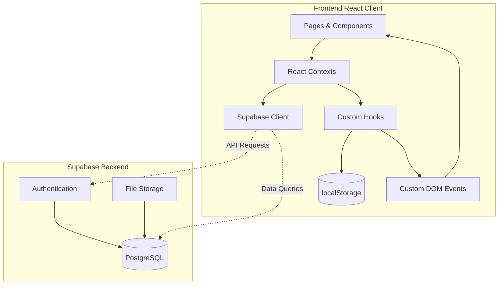

# BranaFilms Studio Management Dashboard

A modern, dark-themed studio management platform for Brana Films. This comprehensive application streamlines equipment tracking, team coordination, production operations, and project analytics with an elegant glassmorphic design. Built for efficiency with responsive layouts and real-time data synchronization.

## 🛡️ Security & Quality Features

This project implements industry-standard security and code quality measures:

- **TypeScript Strict Mode**: Full type safety with proper interfaces
- **ESLint & Prettier**: Automated code linting and formatting
- **Environment Validation**: Zod-based environment variable validation
- **CI/CD Pipeline**: GitHub Actions for automated testing and deployment
- **Docker Support**: Containerized deployment with nginx
- **Supabase Integration**: Secure backend with PostgreSQL database and authentication
- **Error Boundaries**: Graceful error handling for production stability

---

## 🏗️ Architecture & How It Works

The system is built as a **Frontend React Application** with **Supabase** as the backend-as-a-service provider.



### 1. State Management & Real-Time Sync
The application implements a custom-designed client-side persistence and sync system using React hooks:
* **Storage Engine (`useCrudStore`)**: Managed in [use-crud-store.ts](src/hooks/use-crud-store.ts). It abstracts CRUD operations (Create, Read, Update, Delete) and backs them up to `localStorage` for persistence across sessions.
* **Sync Mechanism**: It listens for and dispatches window-level custom events (`crud-sync-${storageKey}`) upon item updates. This ensures that if a crew member is modified on the `TeamPage`, the change immediately reflects in the `Dashboard` or the `Navbar` quick-counters without requiring page refreshes.
* **React Contexts**: Global state management for authentication, team data, gear inventory, finance, and chat functionality.

### 2. Styling & Dark Theme Design
* **Utility-First Styling**: Styled using **Tailwind CSS v4** combined with custom HSL color tokens.
* **Dark Mode & Styling Tokens**: Supported via `next-themes` and configured in [App.tsx](src/App.tsx).
* **shadcn/ui Integration**: UI components built with Radix UI primitives configured in [components.json](components.json).
* **Framer Motion**: Smooth animations and transitions throughout the application.

### 3. Backend & Database
* **Supabase**: Provides PostgreSQL database, authentication, and file storage.
* **Database Migrations**: Located in [supabase/migrations/](supabase/migrations/) for schema versioning.
* **Authentication**: Secure user authentication with session management via [AuthContext.tsx](src/contexts/AuthContext.tsx).

---

## 📁 Folder Structure

Below is an overview of the directory organization in the project:

```
Brana-dashboard/
├── src/                          # Frontend React source code
│   ├── components/               # Shareable components and shadcn UI modules
│   │   ├── ui/                   # Primitive elements (buttons, inputs, select, dialog, etc.)
│   │   ├── loading/              # Loading screen components
│   │   ├── CrudModal.tsx         # Generic CRUD modal for data operations
│   │   ├── DetailsModal.tsx      # Details view modal
│   │   ├── ErrorBoundary.tsx     # Error boundary component
│   │   └── NotificationPanel.tsx # Slide-out sidebar notification panel
│   ├── contexts/                 # React state contexts
│   │   ├── AuthContext.tsx       # Authentication with Supabase
│   │   ├── ChatContext.tsx       # Team chat messages management
│   │   ├── FinanceContext.tsx    # Financial data management
│   │   ├── GearContext.tsx       # Equipment inventory management
│   │   ├── TeamContext.tsx       # Team member management
│   │   └── SearchContext.tsx     # Global search functionality
│   ├── data/                     # Static data and configurations
│   │   └── cloudinary-images.ts  # Cloudinary image references
│   ├── features/                 # Modular, domain-specific modules
│   │   ├── gear/                 # Gear-related components and data
│   │   └── team/                 # Team-related components and data
│   ├── hooks/                    # Custom React hooks
│   │   ├── use-crud-store.ts     # LocalStorage state engine and custom sync event handler
│   │   ├── use-dashboard.tsx     # Context provider for sidebar/notifications panel visibility
│   │   └── use-toast.ts          # Toast feedback triggers
│   ├── layouts/                  # App shell structure containers
│   │   ├── Navbar.tsx            # Main application navigation header
│   │   ├── Sidebar.tsx           # Left-side primary routes selector
│   │   └── Footer.tsx            # Copyright and project analytics footer
│   ├── pages/                    # High-level router pages
│   │   ├── AuthPage.tsx          # Authentication page with sign-up/sign-in
│   │   ├── Dashboard.tsx         # Operations dashboard summary page
│   │   ├── GearEquipmentPage.tsx # Gear management inventory grid
│   │   ├── TeamPage.tsx          # Team roster and analytics list
│   │   ├── SchedulePage.tsx      # Upcoming productions calendar page
│   │   ├── WalletPage.tsx        # Financial dashboard
│   │   ├── ChatPage.tsx          # Team communication chat interface
│   │   └── not-found.tsx         # 404 page handler
│   ├── styles/                   # Stylesheets
│   │   └── globals.css           # Main stylesheet with Tailwind directives
│   ├── App.tsx                   # Main router page switch (Wouter Router)
│   ├── main.tsx                  # React runtime rendering entrypoint
│   └── vite-env.d.ts             # Vite type definitions
│
├── supabase/                     # Supabase backend configuration
│   ├── migrations/               # Database schema migrations
│   │   └── 00001_create_tables.sql
│   ├── config.toml               # Supabase CLI configuration
│   └── .gitignore                # Supabase gitignore
│
├── public/                       # Static public assets directory
│   ├── services/                 # Service icons (SVG)
│   ├── slide/                    # Carousel slide images
│   ├── favicon.svg               # Application favicon
│   ├── manifest.json             # PWA manifest
│   └── robots.txt                # SEO robots file
│
├── .github/                      # GitHub configuration
│   └── workflows/                # CI/CD workflows
│       └── ci.yml                # Continuous integration pipeline
│
├── .env.example                  # Environment variables template
├── .eslintrc.cjs                 # ESLint configuration
├── .gitignore                    # Git ignore rules
├── .prettierrb                   # Prettier configuration
├── components.json               # shadcn/ui configuration
├── docker-compose.yml            # Docker Compose configuration
├── Dockerfile                    # Docker image configuration
├── index.html                    # HTML entry point
├── nginx.conf                    # Nginx configuration for Docker
├── package.json                  # Dependencies and scripts
├── tsconfig.json                 # TypeScript configuration
├── tsconfig.node.json            # TypeScript config for Node.js
├── vercel.json                   # Vercel deployment configuration
├── vite.config.ts                # Vite bundler configuration
└── vitest.config.ts              # Vitest test configuration
```

---

## ⚡ Pages & Features Walkthrough

### 1. Operations Overview
* Located at [Dashboard.tsx](src/pages/Dashboard.tsx).
* Real-time operational metrics including revenue tracking, crew availability, equipment status, and active projects.
* Interactive charts and timeline visualizations for production planning and resource allocation.
* Expandable footer with comprehensive project analytics including budget tracking, task allocation, and team performance metrics.

### 2. Gear & Equipment Manager
* Located at [GearEquipmentPage.tsx](src/pages/GearEquipmentPage.tsx).
* Comprehensive inventory management for studio equipment including cameras, audio gear, lighting, and drones.
* Real-time status tracking (Available, Checked Out, Maintenance, Damaged) with maintenance ticket workflows.
* Quick-add equipment registration and detailed asset management capabilities.

### 3. Team & Crew Roster
* Located at [TeamPage.tsx](src/pages/TeamPage.tsx).
* Centralized crew management for directors, cinematographers, gaffers, editors, and sound engineers.
* Real-time availability tracking and assignment status (In Field, Available, Editing, Off Duty).
* Skills database and project assignment coordination for optimal resource utilization.

### 4. Financial Dashboard
* Located at [WalletPage.tsx](src/pages/WalletPage.tsx).
* Comprehensive financial tracking for expenses, revenue, and invoicing.
* Visual analytics with comparative charts, monthly trends, and invoice distribution insights.
* Budget monitoring and financial performance metrics for informed decision-making.

### 5. Team Communication
* Located at [ChatPage.tsx](src/pages/ChatPage.tsx).
* Integrated messaging platform for seamless team collaboration and project coordination.
* Real-time communication with online status indicators, message search, and conversation history.
* User avatars displayed using the application favicon for consistent branding.

### 6. Project Analytics Footer
* Located at [Footer.tsx](src/layouts/Footer.tsx).
* Expandable footer section with comprehensive project metrics and analytics.
* Real-time display of project count, active team members, total budget, hours logged, completion rates, and task distribution.
* Budget allocation interface for resource planning and task management.

### 🔒 7. Authentication & Security
* **Secure Authentication**: Implemented via [AuthContext.tsx](src/contexts/AuthContext.tsx) with Supabase authentication.
* **Modern Auth Interface**: Located at [AuthPage.tsx](src/pages/AuthPage.tsx) with cinematic visuals and streamlined sign-up flow.
* **Route Protection**: Secure access controls using `RequireAuth` and `GuestOnly` components for protected application areas.

---

## 🚀 Setup & Execution

### Prerequisites
* **Node.js**: Version >= 20.0
* **Package Manager**: npm (standard)
* **Supabase Account**: For backend database and authentication

### Local Development Setup

1. **Install Dependencies**:
   ```bash
   npm install
   ```

2. **Environment Configuration**:
   Copy `.env.example` to `.env` and fill in your Supabase credentials:
   ```bash
   cp .env.example .env
   ```
   Update the following variables in `.env`:
   - `VITE_SUPABASE_URL`: Your Supabase project URL
   - `VITE_SUPABASE_ANON_KEY`: Your Supabase anonymous key

3. **Run the Development Server**:
   ```bash
   npm run dev
   ```
   This starts the Vite development server on http://localhost:5173

### Scripts Reference

| Script | Action |
|---|---|
| `npm run dev` | Starts Vite HMR local server |
| `npm run build` | Bundles production build with type checking |
| `npm run preview` | Runs a local preview of the build bundle |
| `npm run typecheck` | Type-checks code using `tsc` compiler |
| `npm run test` | Runs unit tests using Vitest |
| `npm run test:watch` | Runs unit tests in watch mode |
| `npm run test:coverage` | Runs unit tests and generates coverage report |

---

## 🐳 Docker Deployment

### Build and Run with Docker

1. **Build the Docker image**:
   ```bash
   docker build -t brana-dashboard .
   ```

2. **Run with Docker Compose**:
   ```bash
   docker-compose up -d
   ```

3. **Run standalone**:
   ```bash
   docker run -p 80:80 \
     -e VITE_SUPABASE_URL=your_supabase_url \
     -e VITE_SUPABASE_ANON_KEY=your_supabase_key \
     brana-dashboard
   ```

### Environment Variables for Docker

Required environment variables:
- `VITE_SUPABASE_URL`: Your Supabase project URL
- `VITE_SUPABASE_ANON_KEY`: Your Supabase anonymous key

Create a `.env` file in the project root with these values before running Docker.

---

## 🧭 Routes Map

The application employs `wouter` for lightweight client routing:

| Route | View Component | Description |
|---|---|---|
| `/auth` | `AuthPage` | Authentication page with sign-up/sign-in |
| `/` | `Dashboard` | Operations overview dashboard |
| `/dashboard/team` | `TeamPage` | Crew rosters and team management |
| `/dashboard/schedule` | `SchedulePage` | Production schedule timeline |
| `/dashboard/gears` | `GearEquipmentPage` | Equipment inventory tracker |
| `/dashboard/wallet` | `WalletPage` | Financial dashboard |
| `/dashboard/messages` | `ChatPage` | Team communication chat |
| `*` | `NotFound` | Fallback 404 handler page |

---

## 🧪 Testing

The project uses Vitest for unit testing. Run tests with:

```bash
# Run all tests
npm run test

# Run tests in watch mode
npm run test:watch

# Run tests with coverage
npm run test:coverage
```

---

## 📄 License

MIT
