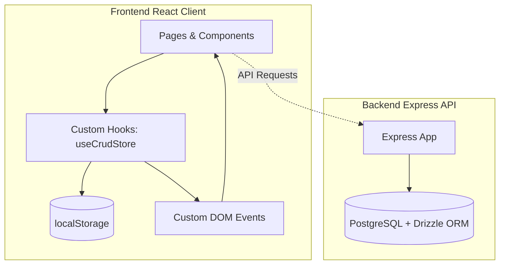

# BranaFilms Studio Management Dashboard

A modern, dark-themed studio management platform for Brana Films. This comprehensive application streamlines equipment tracking, team coordination, and production operations with an elegant glassmorphic design. Built for efficiency with responsive layouts and real-time data synchronization.

## 🛡️ Security & Quality Features

This project implements industry-standard security and code quality measures:

- **TypeScript Strict Mode**: Full type safety with proper interfaces
- **ESLint & Prettier**: Automated code linting and formatting
- **Environment Validation**: Zod-based environment variable validation
- **Security Headers**: X-Frame-Options, X-Content-Type-Options, CSP
- **Content Security Policy**: Strict CSP for XSS prevention
- **CI/CD Pipeline**: GitHub Actions for automated testing and deployment
- **Docker Support**: Containerized deployment with nginx
- **Security Auditing**: Automated dependency vulnerability scanning
- **Structured Logging**: Centralized logging utility for production monitoring

---

## 🏗️ Architecture & How It Works

The system is split into a **Frontend Client** (Vite + React) and a **Backend API Server** (Express).



### 1. State Management & Real-Time Sync
Instead of utilizing heavy external state containers, the application implements a custom-designed client-side persistence and sync system using React hooks:
* **Storage Engine (`useCrudStore`)**: Managed in [use-crud-store.ts](file:///c:/Users/hp/Desktop/Brana-dashboard/src/hooks/use-crud-store.ts). It abstracts CRUD operations (Create, Read, Update, Delete) and backs them up to `localStorage` for persistence across sessions.
* **Sync Mechanism**: It listens for and dispatches window-level custom events (`crud-sync-${storageKey}`) upon item updates. This ensures that if a crew member is modified on the `TeamPage`, the change immediately reflects in the `Dashboard` or the `Navbar` quick-counters without requiring page refreshes or complex provider states.

### 2. Styling & Dark Theme Design
* **Utility-First Styling**: Styled using **Tailwind CSS v4** combined with custom HSL color tokens.
* **Dark Mode & Styling Tokens**: Supported via `next-themes` and configured in [index.html](file:///c:/Users/hp/Desktop/Brana-dashboard/index.html) and [App.tsx](file:///c:/Users/hp/Desktop/Brana-dashboard/src/App.tsx).
* **shadcn/ui Integration**: Layouts leverage Radix UI primitives configured in [components.json](file:///c:/Users/hp/Desktop/Brana-dashboard/components.json).

---

## 📁 Folder Structure

Below is an overview of the directory organization in the project:

```
Brana-dashboard/
├── src/                          # Frontend React source code
│   ├── api/                      # OpenAPI and client-side communication layers
│   │   ├── generated/            # Client libraries generated automatically
│   │   ├── spec/                 # OpenAPI specification spec files
│   │   │   ├── openapi.yaml      # OpenAPI yaml configuration
│   │   │   └── orval.config.ts   # Configuration for API client generation (Orval)
│   │   └── custom-fetch.ts       # Customized fetch abstraction for endpoints
│   ├── assets/                   # Media, logos, and global static assets
│   ├── components/               # Shareable components and shadcn UI modules
│   │   ├── ui/                   # Primitive elements (buttons, inputs, select, dialog, etc.)
│   │   └── NotificationPanel.tsx # Slide-out sidebar notification panel
│   ├── contexts/                 # React state contexts
│   │   ├── AuthContext.tsx       # Frontend Auth, localStorage persistence & 4-user registration limit
│   │   ├── FinanceContext.tsx    # Synced cash ledger records
│   │   ├── GearContext.tsx       # Synced inventory items
│   │   ├── TeamContext.tsx       # Synced staff team profiles
│   │   └── ChatContext.tsx       # Team chat messages management
│   ├── features/                 # Modular, domain-specific modules
│   │   ├── analytics/            # Charts, statistics, and trends components
│   │   ├── gear/                 # Gear CRUD widgets, cards, and data
│   │   ├── team/                 # Team rosters, data files, and members widgets
│   │   └── trading/              # Extra trading charts or financial lists
│   ├── hooks/                    # Custom React hooks
│   │   ├── use-crud-store.ts     # LocalStorage state engine and custom sync event handler
│   │   ├── use-dashboard.tsx     # Context provider for sidebar/notifications panel visibility
│   │   ├── use-mobile.tsx        # Viewport breakpoint utilities for responsiveness
│   │   └── use-toast.ts          # Toast feedback triggers
│   ├── layouts/                  # App shell structure containers
│   │   ├── Navbar.tsx            # Main application navigation header (includes Quick Create buttons)
│   │   ├── Sidebar.tsx           # Left-side primary routes selector
│   │   └── Footer.tsx            # Copyright and system metrics footers
│   ├── pages/                    # High-level router pages
│   │   ├── AuthPage.tsx          # Dual sign-up/sign-in screen with image uploads & carousel slides
│   │   ├── Dashboard.tsx         # Operations dashboard summary page
│   │   ├── GearEquipmentPage.tsx # Gear management inventory grid
│   │   ├── TeamPage.tsx          # Team roster and analytics list
│   │   ├── SchedulePage.tsx      # Upcoming productions calendar page
│   │   ├── WalletPage.tsx        # Bento financial revenue dashboard
│   │   ├── ChatPage.tsx          # Team communication chat interface
│   │   └── not-found.tsx         # 404 page handler
│   ├── styles/                   # Stylesheets
│   │   └── index.css             # Main stylesheet configuring HSL tokens and scrollbars
│   ├── App.tsx                   # Main router page switch (Wouter Router)
│   └── main.tsx                  # React runtime rendering entrypoint
│
├── server/                       # Backend Node/Express source code
│   ├── src/                      # Backend API files
│   │   ├── routes/               # API route endpoints (e.g., health check)
│   │   ├── middlewares/          # Express route middlewares
│   │   ├── lib/                  # Helper utilities and server configurations
│   │   └── app.ts / index.ts     # Server boot files
│   ├── db/                       # Database integration layers
│   │   ├── src/schema/           # Drizzle ORM schema models
│   │   └── drizzle.config.ts     # Drizzle Kit configuration properties
│   └── build.mjs                 # Backend compile and bundling scripts
│
├── public/                       # Static public assets directory
├── package.json                  # Root development dependencies and run scripts
├── tsconfig.json                 # Type safety definitions and path mappings
└── vite.config.ts                # Bundling configuration and local plugins
```

---

## ⚡ Pages & Features Walkthrough

### 1. Operations Overview
* Located at [Dashboard.tsx](file:///c:/Users/hp/Desktop/Brana-dashboard/src/pages/Dashboard.tsx).
* Real-time operational metrics including revenue tracking, crew availability, equipment status, and active projects.
* Interactive charts and timeline visualizations for production planning and resource allocation.

### 2. Gear & Equipment Manager
* Located at [GearEquipmentPage.tsx](file:///c:/Users/hp/Desktop/Brana-dashboard/src/pages/GearEquipmentPage.tsx).
* Comprehensive inventory management for studio equipment including cameras, audio gear, lighting, and drones.
* Real-time status tracking (Available, Checked Out, Maintenance, Damaged) with maintenance ticket workflows.
* Quick-add equipment registration and detailed asset management capabilities.

### 3. Team & Crew Roster
* Located at [TeamPage.tsx](file:///c:/Users/hp/Desktop/Brana-dashboard/src/pages/TeamPage.tsx).
* Centralized crew management for directors, cinematographers, gaffers, editors, and sound engineers.
* Real-time availability tracking and assignment status (In Field, Available, Editing, Off Duty).
* Skills database and project assignment coordination for optimal resource utilization.

### 4. Financial Dashboard
* Located at [WalletPage.tsx](file:///c:/Users/hp/Desktop/Brana-dashboard/src/pages/WalletPage.tsx).
* Comprehensive financial tracking for expenses, revenue, and invoicing.
* Visual analytics with comparative charts, monthly trends, and invoice distribution insights.
* Budget monitoring and financial performance metrics for informed decision-making.

### 5. Team Communication
* Located at [ChatPage.tsx](file:///c:/Users/hp/Desktop/Brana-dashboard/src/pages/ChatPage.tsx).
* Integrated messaging platform for seamless team collaboration and project coordination.
* Real-time communication with online status indicators, message search, and conversation history.
- Supports file sharing, message threading, and team-wide announcements.

### 🔒 6. Authentication & Security
* **Secure Authentication**: Implemented via [AuthContext.tsx](file:///c:/Users/hp/Desktop/Brana-dashboard/src/contexts/AuthContext.tsx) with secure credential management.
* **Modern Auth Interface**: Located at [AuthPage.tsx](file:///c:/Users/hp/Desktop/Brana-dashboard/src/pages/AuthPage.tsx) with cinematic visuals and streamlined sign-up flow.
* **Optimized Profile Management**: Canvas-based image compression for efficient profile photo storage.
* **Route Protection**: Secure access controls using `RequireAuth` and `GuestOnly` components for protected application areas.

---

## 🚀 Setup & Execution

### Prerequisites
* **Node.js**: Version >= 20.0
* **Package Manager**: npm (standard)

### Local Development Setup

1. **Install Frontend and Backend Dependencies**:
   ```bash
   # Root frontend modules installation
   npm install

   # Backend modules installation
   cd server
   npm install
   cd ..
   ```

2. **Run the Development Server**:
   ```bash
   # Starts the Vite frontend on http://localhost:5173
   npm run dev
   ```

3. **Start the Express API Server**:
   ```bash
   cd server
   # Starts backend on the port specified by the PORT environment variable (default: 3000)
   npm run dev
   ```

### Scripts reference

| Script | Location | Action |
|---|---|---|
| `npm run dev` | Root | Starts Vite HMR local server |
| `npm run build` | Root | Bundles production build with type checking |
| `npm run preview`| Root | Runs a local preview of the build bundle |
| `npm run typecheck` | Root / Server | Type-checks code using `tsc` compiler |
| `npm run lint` | Root | Runs ESLint for code quality checks |
| `npm run format` | Root | Runs Prettier for code formatting |
| `npm run dev` | `server/` | Boots node API environment with live reloading |
| `npm run test` | Root | Runs unit tests using Vitest |
| `npm run test:watch` | Root | Runs unit tests in watch mode |
| `npm run test:coverage`| Root | Runs unit tests and generates coverage report |

---

## 🐳 Docker Deployment

### Build and Run with Docker

1. **Build the Docker image**:
   ```bash
   docker build -t brana-dashboard .
   ```

2. **Run with Docker Compose**:
   ```bash
   docker-compose up -d
   ```

3. **Run standalone**:
   ```bash
   docker run -p 80:80 \
     -e VITE_SUPABASE_URL=your_supabase_url \
     -e VITE_SUPABASE_ANON_KEY=your_supabase_key \
     brana-dashboard
   ```

### Environment Variables for Docker

Required environment variables:
- `VITE_SUPABASE_URL`: Your Supabase project URL
- `VITE_SUPABASE_ANON_KEY`: Your Supabase anonymous key

Create a `.env` file in the project root with these values before running Docker.

---

## 🧭 Routes Map

The application employs `wouter` for lightweight client routing:

| Route | View Component | Description |
|---|---|---|
| `/auth` | `AuthPage` | Dual sign-up / sign-in authorization portal |
| `/` | `Dashboard` | Landing Operations Overview |
| `/dashboard/team` | `TeamPage` | Crew rosters page |
| `/dashboard/schedule` | `SchedulePage` | Production schedule timeline |
| `/dashboard/gears` | `GearEquipmentPage` | Equipment inventory tracker |
| `/dashboard/wallet` | `WalletPage` | Studio financial breakdown |
| `/dashboard/messages` | `ChatPage` | Team communication chat |
| `*` | `NotFound` | Fallback 404 handler page |

---

## 📄 License

MIT
