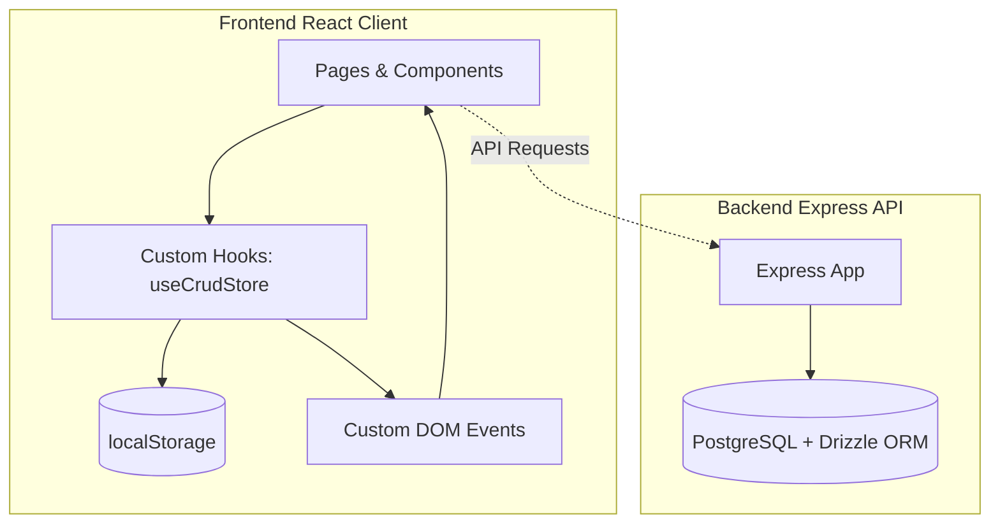

# BranaFilms Studio Operations Dashboard

A premium, dark-themed, full-stack studio operations dashboard designed for film production management. The system is built with a glassmorphic design language, responsive grids, and responsive components optimized for high-density information displays.

---

## 🏗️ Architecture & How It Works

The system is split into a **Frontend Client** (Vite + React) and a **Backend API Server** (Express).



### 1. State Management & Real-Time Sync
Instead of utilizing heavy external state containers, the application implements a custom-designed client-side persistence and sync system using React hooks:
* **Storage Engine (`useCrudStore`)**: Managed in [use-crud-store.ts](file:///c:/Users/hp/Desktop/dashboard-dark/src/hooks/use-crud-store.ts). It abstracts CRUD operations (Create, Read, Update, Delete) and backs them up to `localStorage` for persistence across sessions.
* **Sync Mechanism**: It listens for and dispatches window-level custom events (`crud-sync-${storageKey}`) upon item updates. This ensures that if a crew member is modified on the `TeamPage`, the change immediately reflects in the `Dashboard` or the `Navbar` quick-counters without requiring page refreshes or complex provider states.

### 2. Styling & Dark Theme Design
* **Utility-First Styling**: Styled using **Tailwind CSS v4** combined with custom HSL color tokens.
* **Dark Mode & Styling Tokens**: Supported via `next-themes` and configured in [index.html](file:///c:/Users/hp/Desktop/dashboard-dark/index.html) and [App.tsx](file:///c:/Users/hp/Desktop/dashboard-dark/src/App.tsx).
* **shadcn/ui Integration**: Layouts leverage Radix UI primitives configured in [components.json](file:///c:/Users/hp/Desktop/dashboard-dark/components.json).

---

## 📁 Folder Structure

Below is an overview of the directory organization in the project:

```
dashboard-dark/
├── src/                          # Frontend React source code
│   ├── api/                      # OpenAPI and client-side communication layers
│   │   ├── generated/            # Client libraries generated automatically
│   │   ├── spec/                 # OpenAPI specification spec files
│   │   │   ├── openapi.yaml      # OpenAPI yaml configuration
│   │   │   └── orval.config.ts   # Configuration for API client generation (Orval)
│   │   └── custom-fetch.ts       # Customized fetch abstraction for endpoints
│   ├── assets/                   # Media, logos, and global static assets
│   ├── components/               # Shareable components and shadcn UI modules
│   │   ├── ui/                   # Primitive elements (buttons, inputs, select, dialog, etc.)
│   │   └── NotificationPanel.tsx # Slide-out sidebar notification panel
│   ├── contexts/                 # React state contexts
│   │   ├── AuthContext.tsx       # Frontend Auth, localStorage persistence & 4-user registration limit
│   │   ├── FinanceContext.tsx    # Synced cash ledger records
│   │   ├── GearContext.tsx       # Synced inventory items
│   │   ├── TeamContext.tsx       # Synced staff team profiles
│   │   └── ChatContext.tsx       # Team chat messages management
│   ├── features/                 # Modular, domain-specific modules
│   │   ├── analytics/            # Charts, statistics, and trends components
│   │   ├── gear/                 # Gear CRUD widgets, cards, and data
│   │   ├── team/                 # Team rosters, data files, and members widgets
│   │   └── trading/              # Extra trading charts or financial lists
│   ├── hooks/                    # Custom React hooks
│   │   ├── use-crud-store.ts     # LocalStorage state engine and custom sync event handler
│   │   ├── use-dashboard.tsx     # Context provider for sidebar/notifications panel visibility
│   │   ├── use-mobile.tsx        # Viewport breakpoint utilities for responsiveness
│   │   └── use-toast.ts          # Toast feedback triggers
│   ├── layouts/                  # App shell structure containers
│   │   ├── Navbar.tsx            # Main application navigation header (includes Quick Create buttons)
│   │   ├── Sidebar.tsx           # Left-side primary routes selector
│   │   └── Footer.tsx            # Copyright and system metrics footers
│   ├── pages/                    # High-level router pages
│   │   ├── AuthPage.tsx          # Dual sign-up/sign-in screen with image uploads & carousel slides
│   │   ├── Dashboard.tsx         # Operations dashboard summary page
│   │   ├── GearEquipmentPage.tsx # Gear management inventory grid
│   │   ├── TeamPage.tsx          # Team roster and analytics list
│   │   ├── SchedulePage.tsx      # Upcoming productions calendar page
│   │   ├── WalletPage.tsx        # Bento financial revenue dashboard
│   │   ├── ChatPage.tsx          # Team communication chat interface
│   │   └── not-found.tsx         # 404 page handler
│   ├── styles/                   # Stylesheets
│   │   └── index.css             # Main stylesheet configuring HSL tokens and scrollbars
│   ├── App.tsx                   # Main router page switch (Wouter Router)
│   └── main.tsx                  # React runtime rendering entrypoint
│
├── server/                       # Backend Node/Express source code
│   ├── src/                      # Backend API files
│   │   ├── routes/               # API route endpoints (e.g., health check)
│   │   ├── middlewares/          # Express route middlewares
│   │   ├── lib/                  # Helper utilities and server configurations
│   │   └── app.ts / index.ts     # Server boot files
│   ├── db/                       # Database integration layers
│   │   ├── src/schema/           # Drizzle ORM schema models
│   │   └── drizzle.config.ts     # Drizzle Kit configuration properties
│   └── build.mjs                 # Backend compile and bundling scripts
│
├── public/                       # Static public assets directory
├── package.json                  # Root development dependencies and run scripts
├── tsconfig.json                 # Type safety definitions and path mappings
└── vite.config.ts                # Bundling configuration and local plugins
```

---

## ⚡ Pages & Features Walkthrough

### 1. Operations Overview
* Located at [Dashboard.tsx](file:///c:/Users/hp/Desktop/dashboard-dark/src/pages/Dashboard.tsx).
* Presents quick operational KPIs (YTD Revenue, Active Crew, Gear In-Use, Active Jobs).
* Visualizes business charts via Recharts area diagrams and upcoming shoots timeline metrics.

### 2. Gear & Equipment Manager
* Located at [GearEquipmentPage.tsx](file:///c:/Users/hp/Desktop/dashboard-dark/src/pages/GearEquipmentPage.tsx).
* Manage the film studio's hardware inventory.
* Features filters for categories (Camera, Audio, Lighting, Drone) and status trackers (Available, Checked Out, Maintenance, Damaged).
* Complete inline dialog forms to register new equipment or initiate maintenance tickets.

### 3. Team & Crew roster
* Located at [TeamPage.tsx](file:///c:/Users/hp/Desktop/dashboard-dark/src/pages/TeamPage.tsx).
* Live list of available film crew members (Directors, Cinematographers, Gaffers, Editors, Sound Engineers).
* Tracks current deployment statuses (In Field, Available, Editing, Off Duty) and lists active assignments.

### 4. Bento Financial Wallet
* Located at [WalletPage.tsx](file:///c:/Users/hp/Desktop/dashboard-dark/src/pages/WalletPage.tsx).
* Dashboard for tracking expenses, revenues, and invoices.
* Renders comparative bar-charts, monthly trends, and invoice distribution indicators.

### 5. Team Chat
* Located at [ChatPage.tsx](file:///c:/Users/hp/Desktop/dashboard-dark/src/pages/ChatPage.tsx).
* Real-time team communication interface with message persistence.
* Features team member sidebar with online status indicators, message search, and message history.
* Supports message timestamps, read receipts, and user avatars.

### 🔒 6. Frontend Authorization & Security Gate
* **Client-side Authentication**: Implemented via [AuthContext.tsx](file:///c:/Users/hp/Desktop/dashboard-dark/src/contexts/AuthContext.tsx) storing user credentials securely inside `localStorage`.
* **Split Layout Auth Page**: Formatted at [AuthPage.tsx](file:///c:/Users/hp/Desktop/dashboard-dark/src/pages/AuthPage.tsx) featuring a rotating cinematic slideshow on the left and a 3-step Sign-Up wizard on the right.
* **4-User Capacity Limit**: Restricts new registrations to a maximum of 4 active accounts. 
* **Canvas-based Image Upload Compression**: Re-scales selected profile photos to `120x120px` JPEG at 70% quality, generating optimized tiny payloads (~5-10KB) to ensure `localStorage` stays clean and never exceeds its quota limit.
* **Secure Route Guards**: Gated using `RequireAuth` and `GuestOnly` router components.

---

## 🚀 Setup & Execution

### Prerequisites
* **Node.js**: Version >= 20.0
* **Package Manager**: npm (standard)

### Local Development Setup

1. **Install Frontend and Backend Dependencies**:
   ```bash
   # Root frontend modules installation
   npm install

   # Backend modules installation
   cd server
   npm install
   cd ..
   ```

2. **Run the Development Server**:
   ```bash
   # Starts the Vite frontend on http://localhost:5173
   npm run dev
   ```

3. **Start the Express API Server**:
   ```bash
   cd server
   # Starts backend on the port specified by the PORT environment variable (default: 3000)
   npm run dev
   ```

### Scripts reference

| Script | Location | Action |
|---|---|---|
| `npm run dev` | Root | Starts Vite HMR local server |
| `npm run build` | Root | Bundles production build with type checking |
| `npm run preview`| Root | Runs a local preview of the build bundle |
| `npm run typecheck` | Root / Server | Type-checks code using `tsc` compiler |
| `npm run dev` | `server/` | Boots node API environment with live reloading |

---

## 🧭 Routes Map

The application employs `wouter` for lightweight client routing:

| Route | View Component | Description |
|---|---|---|
| `/auth` | `AuthPage` | Dual sign-up / sign-in authorization portal |
| `/` | `Dashboard` | Landing Operations Overview |
| `/dashboard/team` | `TeamPage` | Crew rosters page |
| `/dashboard/schedule` | `SchedulePage` | Production schedule timeline |
| `/dashboard/gears` | `GearEquipmentPage` | Equipment inventory tracker |
| `/dashboard/wallet` | `WalletPage` | Studio financial breakdown |
| `/dashboard/messages` | `ChatPage` | Team communication chat |
| `*` | `NotFound` | Fallback 404 handler page |

---

## 📄 License

MIT
